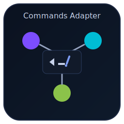

# Commands Adapter 

一个统一的指令转换与互操作工具，支持在 Claude（`.claude/commands`）、Gemini（`.toml`）、Codex（`prompts/*.md`）三方之间进行批量互转，提供校验、事务报告、回滚与将产物快捷复制到项目根目录的能力。

## 核心特性
- 三方互转：`claude ↔ gemini ↔ codex`，任何一方都可导入为 IR 再导出到任意目标平台。
- 语法对齐：
  - Gemini：文件名即命令名（区分大小写），`.toml` 包含 `description/args/prompt/docs.examples/preserve`。
  - Codex：`prompts/<name>.md`，YAML frontmatter（`description/argument-hint/arguments/x-preserve`）+ 正文模板。
  - Claude：JSON/YAML 指令文件（`name/description/arguments/prompt/examples/metadata/runtime`）。
- 质量保证：IR/平台 Schema 校验、差异报告、事务日志与回滚。
- 高性能批量：并发池（`--concurrency`）与目录结构保留输出。
- 快捷安装：一键同步到项目根 `.gemini/commands`、`.codex/prompts`、`.claude/commands`。

## 安装
- 需要 Node.js ≥ 18
- 在仓库根执行：`npm i`，之后通过 `npx cmd-adapter` 或 `npm start` 运行。

## 快速开始
- 列出源指令：`cmd-adapter list --src .claude/commands`
- 单向转换（自动识别输入类型）：`cmd-adapter convert --from auto --to all --src .claude/commands --out ./out`
- 校验产物：`cmd-adapter validate --target all --path ./out`
- 事务文件列表：`cmd-adapter diff --txn <id>`
- 回滚事务：`cmd-adapter rollback --txn <id>`
- 快捷复制到项目根：`cmd-adapter install --platform all --from ./out --to . --strategy backup`

## CLI 命令
- `list`
  - 描述：递归列出源目录中的可识别指令文件（JSON/YAML/TOML/MD）。
  - 示例：`cmd-adapter list --src .claude/commands`
- `convert`
  - 选项：`--from <claude|gemini|codex|auto>`、`--to <claude|gemini|codex|all>`、`--src <dir>`、`--out <dir>`、`--concurrency <n>`、`--log-level <lvl>`
  - 说明：自动探测或指定源平台，将其导入为 IR 后导出至目标平台，并保留源相对结构。
  - 示例：`cmd-adapter convert --from auto --to all --src .claude/commands --out ./out --concurrency 8`
- `validate`
  - 选项：`--target <gemini|codex|claude|ir|all>`、`--path <dir>`
  - 说明：对 `out/` 下产物进行 Schema 校验（IR/Gemini/Codex/Claude）。
  - 示例：`cmd-adapter validate --target all --path ./out`
- `diff`
  - 选项：`--txn <id>`
  - 说明：查看指定事务记录中的文件列表或产物摘要（便于审阅）。
- `rollback`
  - 选项：`--txn <id>`
  - 说明：删除新建文件、恢复备份文件，回到事务执行前的状态。
- `install`
  - 选项：`--platform <gemini|codex|all>`、`--from <dir>`、`--to <dir>`、`--strategy <overwrite|skip|backup>`、`--dry-run`
  - 说明：将 `out/<platform>/...` 快速复制到项目根目录对应位置，默认备份冲突文件。
- `roundtrip`
  - 选项：`--from <claude|gemini|codex>`、`--to <claude|gemini|codex>`、`--src <dir>`、`--out <dir>`
  - 说明：执行 A→IR→B→IR 的往返对比，输出 `added/removed/changed` 差异报告，评估语义损失。

## 产物目录结构
- `out/gemini/commands/<relative>/<name>.toml`
- `out/codex/prompts/<relative>/<name>.md`
- `out/claude/commands/<relative>/<name>.json`（或 `.yaml`）
- 快捷安装目标（项目根）：`.gemini/commands/`、`.codex/prompts/`、`.claude/commands/`

## 语法与语义映射
- 命令名：文件名即命令名；Gemini 区分大小写；Codex 触发名为 `/prompts:<name>`。
- 参数：统一 `name/type/required/default/hint`；Codex 的 `argument-hint` 自动生成（必填 `<arg>`，可选 `[arg]`）。
- 提示词：合并系统/用户片段至 `prompt`；Codex 正文、Gemini 多行字符串、Claude `prompt` 字段。
- 示例：Gemini `docs.examples` ↔ Codex `## Examples` ↔ Claude `examples[]`。
- 运行时/工具：不支持项保留至 `metadata/runtime` 并在 `roundtrip` 报告中标注降级。

## 性能与并发
- `--concurrency <n>` 控制并发；默认 8。
- 流式读写与细粒度异常处理；保持原始目录层级以加速审阅。

## 回滚与事务
- 每次 `convert`/`install` 生成事务 ID，记录新建文件与备份快照。
- `rollback --txn <id>` 恢复至执行前状态；搭配 `diff` 审阅内容。

## 兼容性与限制
- TOML/YAML 采用成熟解析库；frontmatter 需位于 Markdown 首段。
- 对于平台不支持的高级特性（如部分 MCP 工具），会保留到 `x-preserve`/`preserve`/`metadata.extra`，并在往返报告注明。

## 开发与测试
- 依赖管理：`npm i`
- 本地运行：`npm start -- <args>` 或 `node src/index.js <command>`
- 示例输入：`.claude/commands/example.json`
- 运行本地单测：`npm test`
- GitHub Actions：`.github/workflows/ci.yml`（构建与单测）

## 参考
- Gemini CLI: Custom slash commands（.toml 与命令名规则）
  https://cloud.google.com/blog/topics/developers-practitioners/gemini-cli-custom-slash-commands
- Codex CLI: Slash commands（Markdown + frontmatter 与 /prompts:<name> 触发）
  https://developers.openai.com/codex/guides/slash-commands/
